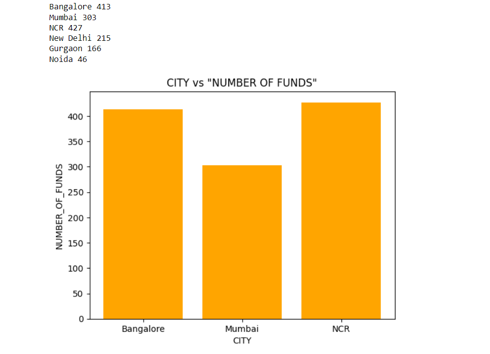
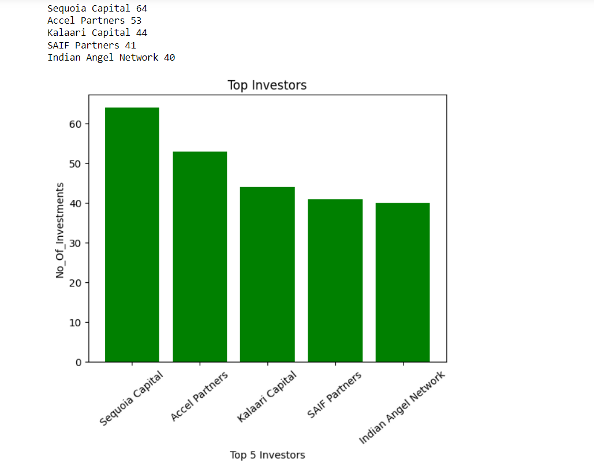
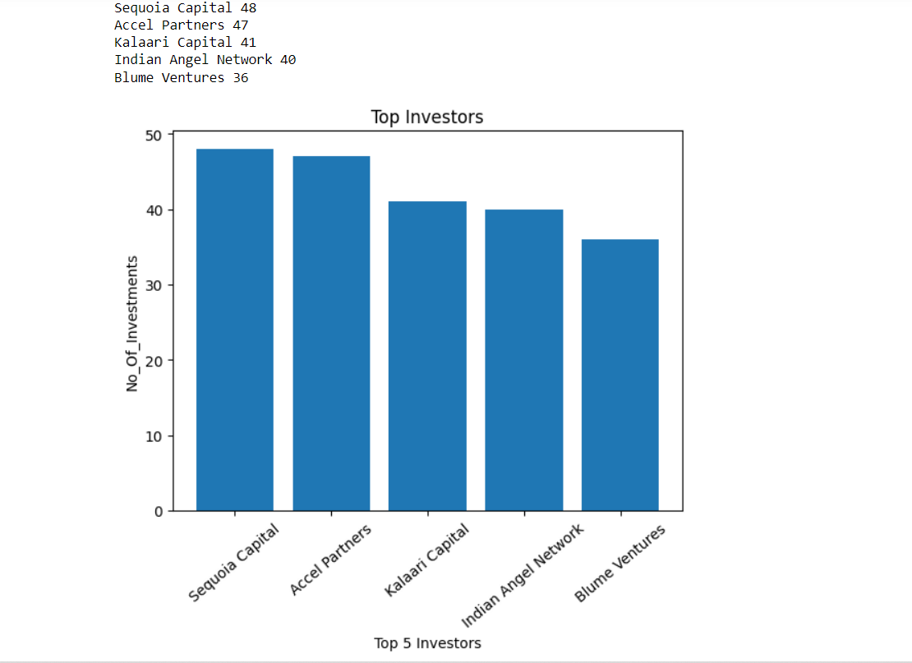
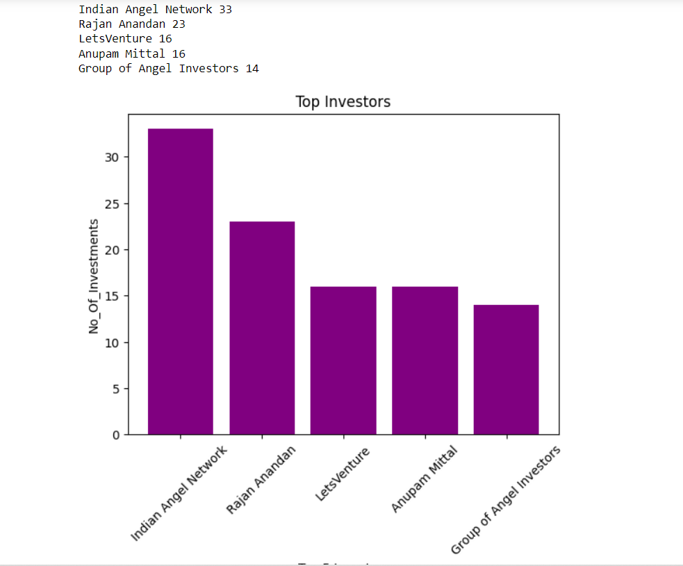
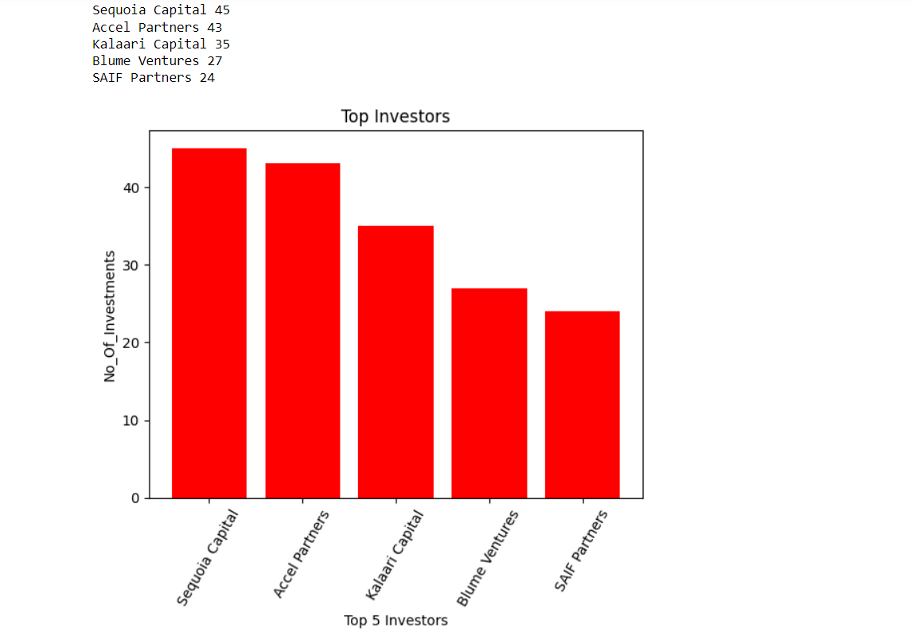

# caseStudy.github.io
> **EXPLANATION OF CASESTUDY PART 2**
>
> 1.Your Friend has developed the Product and he wants to establish the
> product startup and he is searching for a perfect location where
> getting the investment has a high chance. But due to its financial
> restriction, he can choose only between three locations - Bangalore,
> Mumbai, and NCR. As a friend, you want to help your friend deciding
> the location. NCR include Gurgaon, Noida and New Delhi. Find the
> location where the most number of funding is done. That means, find
> the location where startups has received funding maximum number of
> times. Plot the bar graph between location and number of funding. Take
> city name \"Delhi\" as \"New Delhi\". Check the case-sensitiveness of
> cities also. That means, at some place instead of \"Bangalore\",
> \"bangalore\" is given. Take city name as \"Bangalore\". For few
> startups multiple locations are given, one Indian and one Foreign.
> Consider the startup if any one of the city lies in given locations.

{width="5.315277777777778in"
height="3.841666666666667in"}

EXPLANATION:

The following result shows startups have received funding maximum number
of times in NCR out of NCR, Mumbai and Bangalore. Therefore, I would
recommend my friend to choose NCR as the location for the startup to
maximise the chance of getting fundings.

If considered city wise, startups have received funding maximum number
of times in Bangalore.

> 2.Even after trying for so many times, your friend's startup could not
> find the investment. So you decided to take this matter in your hand
> and try to find the list of investors who probably can invest in your
> friend's startup. Your list will increase the chance of your friend
> startup getting some initial investment by contacting these investors.
> Find the top 5 investors who have invested maximum number of times
> (consider repeat investments in one company also). In a startup,
> multiple investors might have invested. So consider each investor for
> that startup. Ignore undisclosed investors.
>
> {width="5.823611111111111in"
> height="4.568054461942257in"}

EXPLANATION:

The following result shows the top 5 investors who have invested in
startups recently. I would recommend my friend to contact these
investors to get funding for the startup. Out of these 5, Sequoia
Capital have invested the most number of times in startups i.e. 64
times.

In this I have ignored the undisclosed investors.

> 3.After re-analysing the dataset you found out that some investors
> have invested in the same startup at different number of funding
> rounds. So before finalising the previous list, you want to improvise
> it by finding the top 5 investors who have invested in different
> number of startups. This list will be more helpful than your previous
> list in finding the investment for your friend startup. Find the top 5
> investors who have invested maximum number of times in different
> companies. That means, if one investor has invested multiple times in
> one startup, count one for that company. There are many errors in
> startup names. Ignore correcting all, just handle the important ones -
> Ola, Flipkart, Oyo and Paytm.

{width="5.673611111111111in"
height="4.125in"}

EXPLANATION:

The following result shows the top 5 investors who have invested in
different startups recently. I would recommend my friend to contact
these investors to get funding for the startup. This gives a better
insight into the investors that invest in different startups.

Out of these 5, Sequoia Capital have invested the most number of times
in different startups i.e. 48 different startups.

In this I have ignored the undisclosed investors.

> 4.Even after putting so much effort in finding the probable investors,
> it didn\'t turn out to be helpful for your friend. So you went to your
> investor friend to understand the situation better and your investor
> friend explained to you about the different Investment Types and their
> features. This new information will be helpful in finding the right
> investor. Since your friend startup is at an early stage startup, the
> best-suited investment type would be - Seed Funding and Crowdfunding.
> Find the top 5 investors who have invested in a different number of
> startups and their investment type is Crowdfunding or Seed Funding.
> Correct spelling of investment types are - \"Private Equity\", \"Seed
> Funding\", \"Debt Funding\", and \"Crowd Funding\". Keep an eye for
> any spelling mistake. You can find this by printing unique values from
> this column. There are many errors in startup names. Ignore correcting
> all, just handle the important ones - Ola, Flipkart, Oyo and Paytm.
>
> {width="5.323611111111111in"
> height="4.4125in"}

EXPLANATION:

The following result shows the top 5 investors who have invested in
different early stage startups recently. I would recommend my friend to
contact these investors to get funding for the startup in the early
days. This gives a better insight into the investors that invest in
early stage startups.

Out of these 5, Indian Angel Network have invested the most number of
times in early stage startups i.e. 33 different early stage startups.

In this I have ignored the undisclosed investors.

> 5.Due to your immense help, your friend startup successfully got seed
> funding and it is on the operational mode. Now your friend wants to
> expand his startup and he is looking for new investors for his
> startup. Now you again come as a saviour to help your friend and want
> to create a list of probable new new investors. Before moving forward
> you remember your investor friend advice that finding the investors by
> analysing the investment type. Since your friend startup is not in
> early phase it is in growth stage so the best-suited investment type
> is Private Equity. Find the top 5 investors who have invested in a
> different number of startups and their investment type is Private
> Equity. Correct spelling of investment types are - \"Private Equity\",
> \"Seed Funding\", \"Debt Funding\", and \"Crowd Funding\". Keep an eye
> for any spelling mistake. You can find this by printing unique values
> from this column. There are many errors in startup names. Ignore
> correcting all, just handle the important ones - Ola, Flipkart, Oyo
> and Paytm.

{width="5.690277777777778in"
height="3.941666666666667in"}

EXPLANATION:

The following result shows the top 5 investors who have invested in
different growth stage startups recently. I would recommend my friend to
contact these investors to get funding for the startup in the growth
stage. This gives a better insight into the investors that invest in
growth stage startups.

Out of these 5, Sequoia Capital have invested the most number of times
in growth stage startups i.e. 45 different growth stage startups.

In this I have ignored the undisclosed investors.
